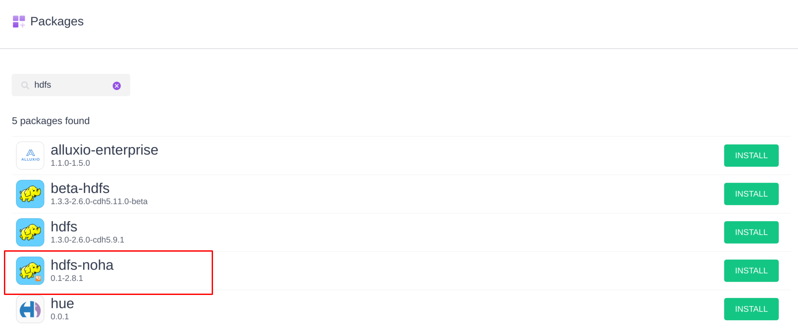
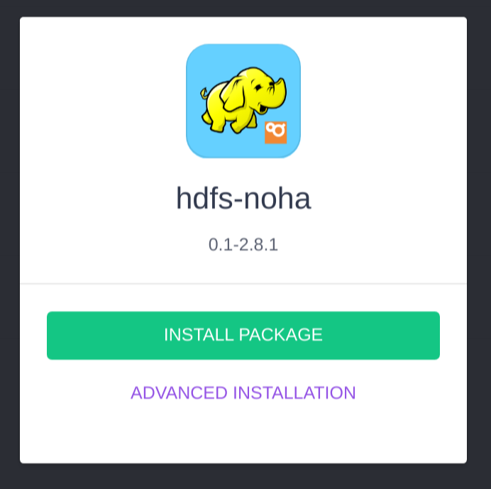
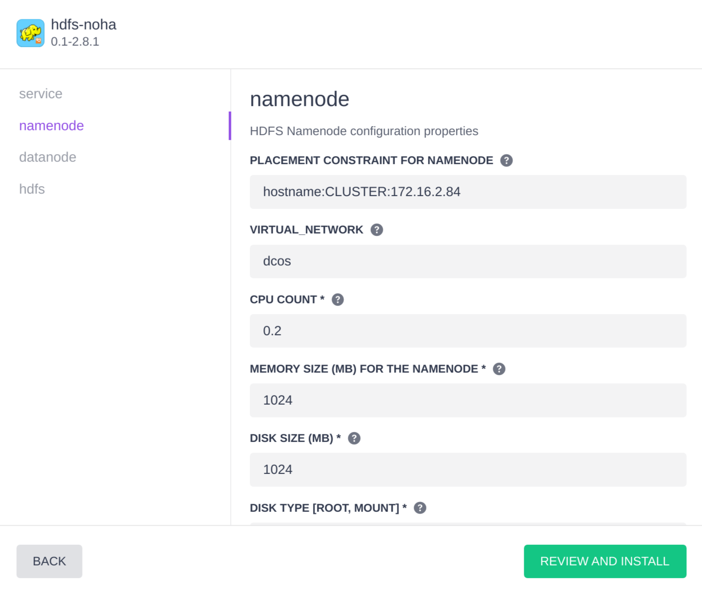
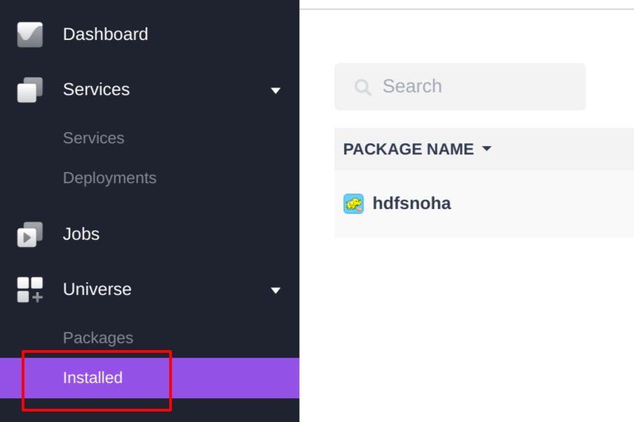
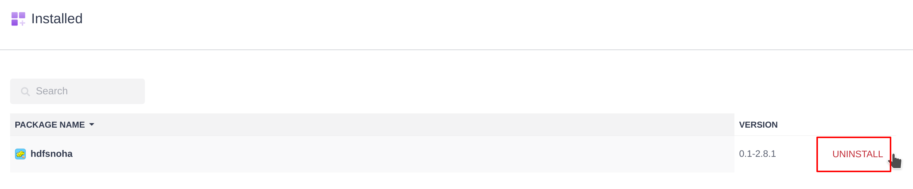

# hdfs-noha

## Table of Contents

- [Overview](#overview)
- [Quick Start](#quick-start)
- [Advanced Installation](#advanced-install)
- [Uninstallation](#uninstall)

<a name="overview"></a>
# Overview
This framework is designed to deploy a *simple* HDFS cluster without HA capabilities. 
Sometimes you just want to deploy a HDFS cluster to test a feature of an application 
you're developping or when a data scientist just needs a distributed file system like 
HDFS for few months. This service is for a **non-production** environments and is experimental.
This framework is based on [dcos-commons](https://github.com/mesosphere/dcos-commons).

If you want a HDFS service with high availability then you'd better take a look at this [HDFS service](https://github.com/fmarchand/dcos-commons/tree/master/frameworks/hdfs) in DC/OS Universe

This service use Hadoop 2.8.1 to run the datanodes and the namenode.

<a name="quick-start"></a>
# Quick Start

1. If you have a dcos client configured on your machine then you can install the service with the command :
````
$ dcos package install --yes hdfs-noha
````
With the default configuration you'll have 1 namenode with 1 datanode. You can customize the installation with a json file if you want.

2. You can deploy your HDFS cluster from the DC/OS Web Interface.
 Search for the `hdfs-noha` service in the Universe package list
 
 
 
 Then click on `Install`. To install with the default configuration, you can click on `Install package`.
 
 
 
<a name="advanced-install"></a>
# Advanced installation 

You can install the HDFS NoHA with costumized configuration. 

- From the command line with a dcos client : 

````
$ dcos package install hdfs-noha --yes --options=config.json 
````

Here is an example of the config.json file
````json
{
  "service": {
    "name": "hdfsnoha",
    "user": "root",
    "virtual_networks": false,
    "log_level": "INFO"
  },
  "namenode": {
    "placement_constraint": "hostname:CLUSTER:172.16.2.84",
    "virtual_network": "dcos",
    "cpus": 0.2,
    "mem": 1024,
    "disk": 1024,
    "disk_type": "ROOT"
  },
  "datanode": {
    "count": 3,
    "placement_constraint": "hostname:UNIQUE",
    "virtual_network": "dcos",
    "cpus": 0.2,
    "mem": 1024,
    "disk": 1024,
    "disk_type": "ROOT"
  },
  "hdfs": {
    "dfs_replication": 1,
    "name_node_rpc_port": 9001,
    "name_node_http_port": 9002,
    "data_node_rpc_port": 9003,
    "data_node_http_port": 9004,
    "data_node_ipc_port": 9005
  }
}
````
In this example, for instance the namenode will be deployed on `172.16.2.84` and the datanodes will use 1024Mb of memory.
 
- or from the DC/OS Web interface using `Advanced Installation` button:


## Customizable properties
<table class="table">
  <tr><td colspan="3" align="center">Service Section</td></tr>
  <tr>
    <th>Property</th>
    <th>Type</th>
    <th>Description</th>
  </tr>
  <tr>
    <td>name</td>
    <td>string</td>
    <td>The name of the service.</td>
  </tr>
  <tr>
    <td>user</td>
    <td>string</td>
    <td>User to use to run the framework.</td>
  </tr>
  <tr>
    <td>virtual_network</td>
    <td>boolean</td>
    <td>use or not dcos virtual network for this service.</td>
  </tr>
  <tr>
    <td>log_level</td>
    <td>string</td>
    <td>Log level for the scheduler.</td>
  </tr>
  <tr>
    <td>principal</td>
    <td>string</td>
    <td>The principal for the service instance, or empty to use the default.</td>
  </tr>
  
  <tr><td colspan="3" align="center">Namenode Section</td></tr>
  
  <tr>
    <td>placement_constraint</td>
    <td>string</td>
    <td>Marathon-style placement constraint for the namenode. Example: 'hostname:UNIQUE' or 'hostname:LIKE:172.16.2.8[5-7]'</td>
  </tr>
  <tr>
    <td>virtual_network</td>
    <td>string</td>
    <td>Name of virtual network to join if virtual network is enabled for this service.</td>
  </tr>
  <tr>
      <td>cpus</td>
      <td>number</td>
      <td>CPU count to allocate for the namenode.</td>
  </tr>
  <tr>
    <td>mem</td>
    <td>integer</td>
    <td>The amount of memory, in MB, allocated to the namenode.</td>
  </tr>

  <tr>
    <td>disk</td>
    <td>integer</td>
    <td>The amount of disk, in MB, allocated to the namenode.</td>
  </tr>

  <tr>
    <td>disk_type</td>
    <td>string</td>
    <td>The type of disk to use for storing data. Possible values: <b>ROOT</b> (default) and <b>MOUNT</b>.
    <ul>
    <li><b>ROOT:</b> Data is stored on the same volume as the agent work directory and the node tasks use the configured amount of <i>disk</i> space.</li>
    <li><b>MOUNT:</b> Data will be stored on a dedicated, operator-formatted volume attached to the agent. Dedicated MOUNT volumes have performance advantages and a disk error on these MOUNT volumes will be correctly reported to HDFS.</li>
    </ul>
    </td>
  </tr>
  
  <tr><td colspan="3" align="center">Datanode Section</td></tr>
  <tr>
    <td>placement_constraint</td>
    <td>string</td>
    <td>Marathon-style placement constraint for datanodes. Example: 'hostname:UNIQUE' or 'hostname:LIKE:172.16.2.8[5-7]'</td>
  </tr>
  <tr>
    <td>virtual_network</td>
    <td>string</td>
    <td>Name of virtual network to join if virtual network is enabled for this service.</td>
  </tr>
  <tr>
      <td>cpus</td>
      <td>number</td>
      <td>CPU count to allocate for each datanode.</td>
  </tr>
  <tr>
    <td>mem</td>
    <td>integer</td>
    <td>The amount of memory, in MB, allocated to each datanode.</td>
  </tr>
    
  <tr>
    <td>disk</td>
    <td>integer</td>
    <td>The amount of disk, in MB, allocated to each datanode.</td>
  </tr>
    
  <tr>
    <td>disk_type</td>
    <td>string</td>
    <td>The type of disk to use for storing data. Possible values: <b>ROOT</b> (default) and <b>MOUNT</b>.
    <ul>
    <li><b>ROOT:</b> Data is stored on the same volume as the agent work directory and the node tasks use the configured amount of <i>disk</i> space.</li>
    <li><b>MOUNT:</b> Data will be stored on a dedicated, operator-formatted volume attached to the agent. Dedicated MOUNT volumes have performance advantages and a disk error on these MOUNT volumes will be correctly reported to HDFS.</li>
    </ul>
    </td>
  </tr>
  <tr>
    <td>strategy</td>
    <td>string</td>
    <td>The strategy used to deploy datanodes. Possible values: <b>parallel</b> (default) and <b>serial</b>.
    <ul>
    <li><b>parallel:</b> All nodes of that type are deployed at the same time.</li>
    <li><b>serial:</b> All nodes of that type are deployed in sequence.</li>
    </ul>
    </td>
  </tr>

  <tr>
    <td>count</td>
    <td>integer</td>
    <td>The number of nodes of that node type for the cluster. There are always exactly two name nodes, so the name_node object has no count property. Users may select either 3 or 5 journal nodes. The default value of 3 is sufficient for most deployments and should only be overridden after careful thought. At least 3 data nodes should be configured, but this value may be increased to meet the storage needs of the deployment.</td>
  </tr>
</table>

<a name="uninstall"></a>
# Uninstallation

There's two ways to uninstall :

- from the command line :
````
$ dcos package uninstall --app-id=hdfs-noha hdfs-noha
````

NOTE : --app-id is optional but it is necessary if you used a service name different from the default one (`hdfs-noha`)

- From DC/OS Web interface :
  - Select the `Installed section under `Universe`.

  - Move the mouse on the right of the version, an `uninstall` button should appear.


For the two methods you need to use the janitor to remove the framework from Zookeeper :
````
$ dcos node ssh --master-proxy --leader "docker run mesosphere/janitor /janitor.py -r hdfsnoha-role -p hdfsnoha-principal -z dcos-service-hdfsnoha"
````

### 1.0.1-1.0.0
#### Breaking Changes
#### New Features
#### Improvements
#### Bug Fixes

### 1.0.0-1.0.0
#### Breaking Changes
#### Features
#### Improvements
#### Bug Fixes
